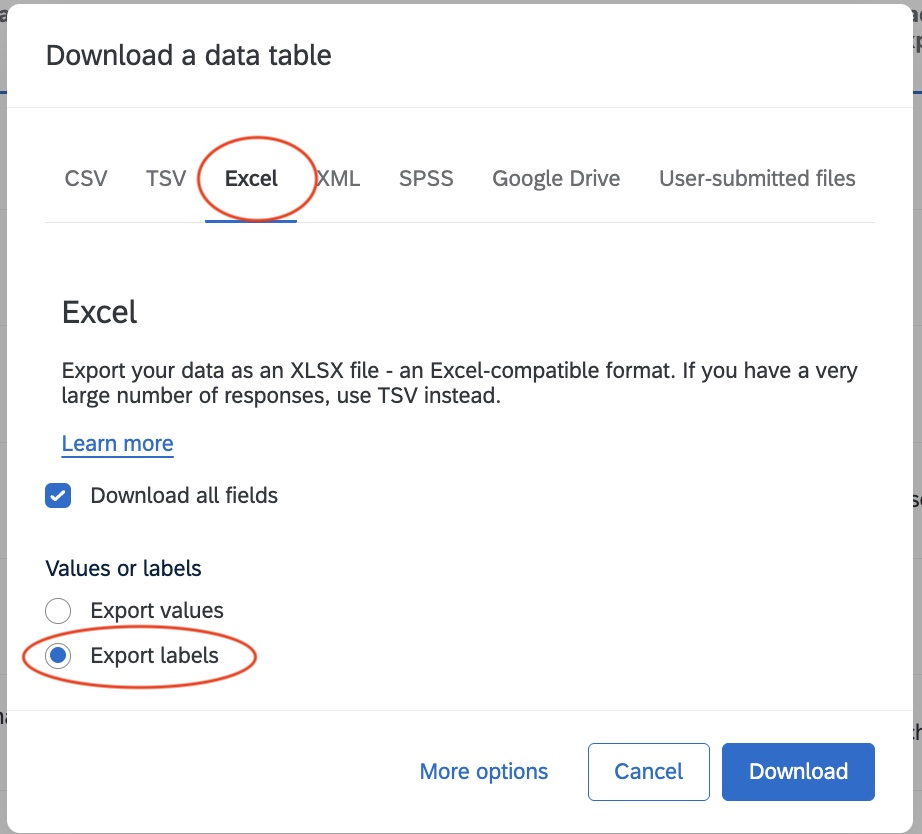

# Requirements
* Rstudio + Libraries to run R Markdown (will at least require tinytex) 
* R libraries : `dplyr`, `readxl`, `here`, `openxlsx`

# Scoring Materials
1. Download the submission table from the Symposium Qualtrics submission form in EXCEL format (NOT csv, you will lose the special characters if you do csv), 

2. Rename this file `UW table sample symposium.xlsx` and move it to the folder "Qualtrics_Tables", 
3. Open the project `Abstract Submissions.Rproj` in Rstudio
  * Open the file `create_text_file_for_scoring_materials` (in the Scripts folder)
  * Run the whole script, you will see a `txt` , an `Rmd`, and an `xlsx` file appear in the folder `Blitz_Talks_Abstracts_For_Scoring_Materials`
4. Open in Rstudio the file `blitz_abstract_texts.Rmd` that was just created (or just updated)
5. Knit the Rmd file, this will create a Word document in the folder `Blitz_Talks_Abstracts_For_Scoring_Materials`. 
6. Check that all the formatting and all the information are correct for the abstracts
7. Send the table of abstracts `blitz_abstracts_table_for_review.xlsx` to the person in charge of the sending the scoring material to the reviewers. They will use this table to populate the scoring sheets for the reviewers. 
8. Done! 

